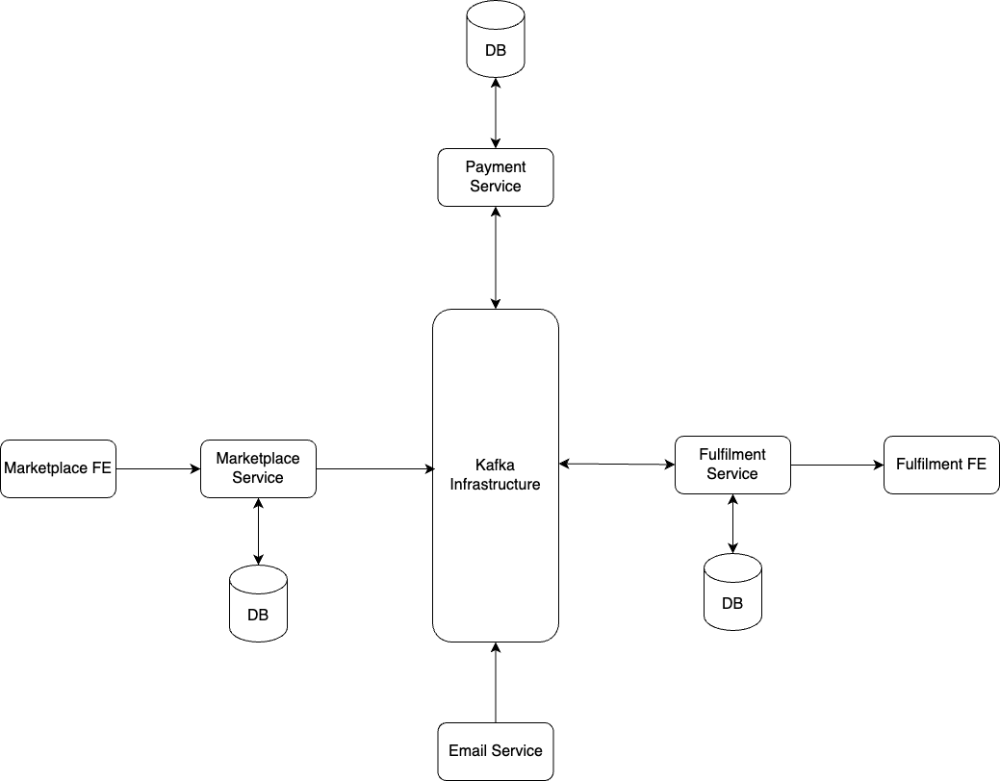

# Kafka E-Commerce

Kafka E-Commerce is demo "distributed" system used to learn the basics of [Apache Kafka](https://kafka.apache.org/). 
Apache Kafka is an open-source distributed event streaming platform. Kafka E-Commerce simulates an e-commerce system 
with the following functionalities:
* A user can add items to their cart and place an order
* Payment is processed for the order while an email sent to the user informing them that their order has been placed
* The fulfillment team processed and fulfils the order
* The user is notified that their order has been dispatched



## Running the application

Clone the repository and in the root folder, run the following command
```
$ docker-compose up -d
```
This builds (if running for the first time) and starts the Docker containers.

## REST Endpoints

The "frontends" are REST endpoints that can be called with `curl` or using a tool like Postman or Insomnia.

### Marketplace

#### List Products

```
GET http://localhost:8080/marketplace/products
```

#### Add to Cart

```
POST http://localhost:8080/marketplace/add
{
    "userId": 1,
    "productId": 18,
    "quantity": 5
}
```

#### Place order

```
POST http://localhost:8080/marketplace/order
{
    "userId": 1
}
```

### Fulfilment

#### List orders

```
GET http://localhost:6000/fulfilment/list
GET http://localhost:6000/fulfilment/list?is_fulfilled=false
GET http://localhost:6000/fulfilment/list?is_fulfilled=true
```

#### Fulfil order

```
POST http://localhost:6000/fulfilment/process
{
    "order_id": "acf1e7ff-75da-4f01-b52f-2d38cf09eba9"
}
```

## Technologies

* Docker
* Java + Spring Boot
* Python + FastAPI
* Apache Kafka
